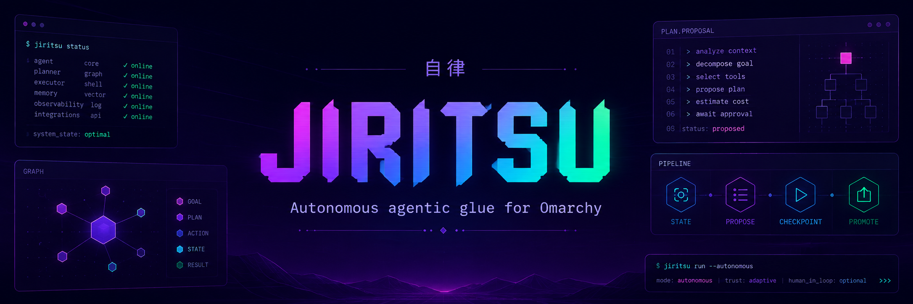

# Jiritsu



> Agentic glue for an agent-first Omarchy system.

Jiritsu is an experimental set of small Linux tools for people and autonomous agents. The project adds structured state, intent, recovery, and controlled authority.

The name comes from the Japanese word `自律` (*jiritsu*), which means autonomy or self-direction.

Omarchy remains the opinionated, human-facing system. Jiritsu uses Omarchy methods first and adds agent-focused capabilities around them.

This repository contains the first complete experimental version of the six-module Jiritsu stack.

> [!IMPORTANT]
> Jiritsu is in early active development. Interfaces can change, modules can break, and incomplete ideas can disappear.
>
> This project is not ready for production use. It does not have a stable release or a complete installation guide.

## Why Jiritsu Exists

An agent with shell access can act, but it lacks several important system concepts. Shell access alone does not provide safe autonomy.

Jiritsu adds these concepts:

- Agents use current machine facts, not model memory.
- Each machine describes the workloads and capabilities that matter locally.
- Each change starts as durable intent instead of an immediate command.
- Recovery points protect supported machine state before a change starts.
- A broker controls agent authority through narrow operations and deterministic policy.
- Skills teach supported Omarchy methods, but they do not grant permissions.

The complete project follows one path:

```text
observe -> describe -> propose -> checkpoint -> apply -> verify -> commit or roll back
```

Each module also provides value before the complete path exists.

## Modules

| Module | Status | Purpose |
| --- | --- | --- |
| [`jiritsu-stated`](jiritsu-stated/) | First version | Reports stable, source-aware facts about the current machine. |
| [`jiritsu-workload`](jiritsu-workload/) | First version | Defines local workload contracts and assesses important capabilities. |
| [`jiritsu-proposals`](jiritsu-proposals/) | First version | Records intended changes, risk, approval, verification, and history. |
| [`jiritsu-checkpoints`](jiritsu-checkpoints/) | First version | Creates recovery points that relate to machine changes. |
| [`jiritsu-broker`](jiritsu-broker/) | First version | Exposes narrow Jiritsu operations to agents under deterministic policy. |
| [`jiritsu-skills`](jiritsu-skills/) | First version | Teaches agents how to use Omarchy and Jiritsu correctly. |

Every module has its own README. That README describes the current contract, boundaries, and development commands for the module.

## What Works Today

`jiritsu-stated` reports system, package, service, hardware, network, and snapshot facts. It returns stable JSON with source and observation details.

The module also replays captured source data through its production parsers. This process gives its important collection paths deterministic tests.

`jiritsu-workload` loads readable TOML contracts and assesses their capabilities. Its direct probes cover commands, environment variables, paths, and systemd units.

The module includes contracts for an Omarchy desktop and an agent development environment. User contracts can override these defaults.

`jiritsu-proposals` records typed user-configuration changes as durable JSON objects. It classifies, approves, applies, verifies, commits, or restores each proposal.

`jiritsu-checkpoints` creates identifiable Snapper recovery points. It can also capture and restore selected user configuration through an explicit policy.

`jiritsu-broker` exposes typed operations for state, workloads, proposal lifecycle steps, and checkpoint inspection. Ordered TOML rules grant the authority for each operation.

Sensitive operations use request-bound external approvals. An audit journal records each request, decision, action, and result.

`jiritsu-skills` provides five discoverable skills for observation, changes, workloads, recovery, and broker administration.

The skills use the live broker catalog by default. If the broker is absent, they use direct module commands.

The skills never bypass a broker denial.

The complete stack forms one implemented path:

```text
skills -> broker -> stated + workload -> proposals -> checkpoints -> apply -> verify
```

Proposal classification records stated and workload evidence. Promotion creates a linked checkpoint by default, applies the typed actions, and compares critical workloads before it commits. Each integration reports its selected provider, source, and fallback errors.

All five runtime modules still work independently. If an optional module is missing, an equivalent Omarchy or Linux provider takes its place.

If no equivalent baseline exists, only the dependent feature becomes unavailable. Startup and unrelated operations continue.

The skill set also passed a fresh-context agent trial. The agent used the installed skill guidance without prior Jiritsu conversation context.

## Try the Implemented Modules

Python 3.11 or newer is required. Run these development commands from the repository root:

```bash
./jiritsu-stated/bin/jiritsu-stated query system hardware --pretty
./jiritsu-workload/bin/jiritsu-workload assess --pretty
./jiritsu-proposals/bin/jiritsu-proposals paths --pretty
./jiritsu-checkpoints/bin/jiritsu-checkpoints inspect --pretty
./jiritsu-broker/bin/jiritsu-broker catalog --pretty
./jiritsu-skills/bin/jiritsu-skills-install --dry-run
```

These commands run directly from the source tree. They do not install files outside the module directories.

The module READMEs contain the current usage details. Comprehensive installation instructions will come after the project has stable installation behavior.

## Remaining Work

The first full version proves the complete path, but it does not make Jiritsu production-ready.

Further work remains in these areas:

- Add a stable installation and release workflow.
- Deploy the broker through a protected operating-system trust boundary.
- If live experiments require new typed proposal actions, add only those actions.
- If existing recovery paths are insufficient, add only the required checkpoint scopes.
- Continue live trials across complete and standalone module paths.

New work must preserve standalone fallbacks and the broker authority boundary.

## Project Principles

Each module follows these principles:

- The module remains useful, understandable, and replaceable by itself.
- The public Omarchy interface is the first choice for machine operations.
- Standard Linux mechanisms fill genuine gaps in Omarchy.
- Structured facts and deterministic probes provide evidence.
- Machine changes stay explicit, narrow, and reversible where possible.
- Focused tests protect important behavior and keep the experiment fast.

Jiritsu is agentic glue, not a new operating system. The project favors tangible experiments over speculative frameworks and premature abstraction.
